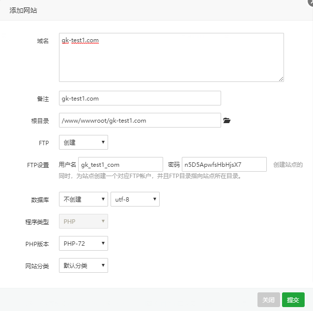
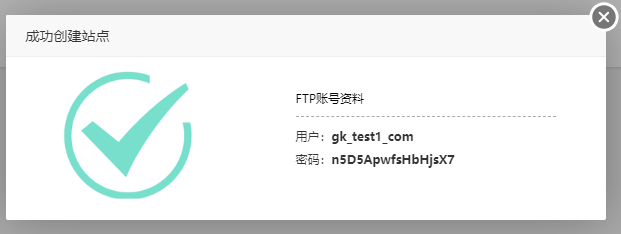
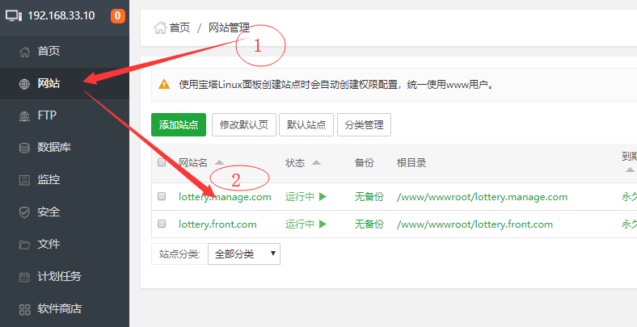

# Linux常用操作

<a href="#1">第一段</a>

## 1、Vagrant中的Linux 


Vagrant是简便虚拟机操作的一个软件
### 1.1、使用Vagrant虚拟机的好处：

* 1、为了开发环境与生产环境一致（很多开发环境为windows而生产环境为linux），不至于出现在开发环境正常而移步到正式生产环境时出现各种问题，而vagrant通过共享文件，可以实现在主机（windows）下的IDE编写代码操作，直接在虚拟机（linux）中运行展示出效果。

*  2、在vagrant中只需要搭配一次开发环境，然后就可以将搭配好的环境系统镜像打包发送给其他的同事用了，其他同事只需要下载vagrant和virtualBox，然后配置下共享目录后就可以开发了，再也不需要关心配置环境的问题了。

*  3、目前好多扩展如swoole、redis等对linux支持更好，甚至有些只支持linux，所以采用虚拟机，再也不需要为学习新技术找借口了。
相关环境机软件版本：主机：win10；虚拟机：CentOS 7.2 x86_64；vagrant：2.0.3；virtualBox：5.2.8

### 1.2、安装Vagrant虚拟的步骤如下：
 - 1、下载virtualBox，地址点这里，安装
 - 2、下载vagrant，地址点这里，安装
 - 3、下载镜像，有几个地方可以下载：
   > http://www.vagrantbox.es,
   https://atlas.hashicorp.com/boxes/search都可以，
   这里我随便找了个centos65-x86_64-20140116
 - 4、将下载的镜像加载，顺便说下，第3步可以不用，vagrant支持在线安装镜像，但由于长城的原因，所以最好通过其它方法将镜像下载下来,再在本地加载,，打开cmd，输入以下命令：
 
 ```
 vagrant box add {title} {url}
 vagrant init {title}
 vagrant up

 ```

### 1.3、进入Vagrant Linux虚拟的步骤如下：
打开cmd（命令行/终端），输入以下命令：

```
>vagrant ssh
Last login: Thu Apr 18 18:00:34 2019 from 10.0.2.2
[vagrant@localhost ~]$

[vagrant@localhost ~]$ su root
Password:
vagrant

[root@localhost vagrant]#
```
命令提示符说明：
  * ">vagrant ssh"中的 “>” 是dos(win10终端)的命令提示符，
  * “$” 是Unix/类Unix(Linux)中普通用户命令提示符
  * “#" 是Unix/类Unix(Linux)中系统管理用户命令提示符

### 1.4、使用宝塔Linux面板代替命令行：
#### 1.4.1、安装宝塔Linux面板
 - 1、在Linux的终端执行如下命令：
```
# yum install -y wget && wget -O install.sh http://download.bt.cn/install/install_6.0.sh && sh install.sh
```
 - 2、宝塔Linux面板登录信息显示（本地vagrant）

```
上述安装程序执行完成后，
显示如下信息：（具体内容因人而异）
Bt-Panel: http://192.168.33.10:8888/e937db4e
username: fihq9pmi
password: cf99d8a1
Warning:
If you cannot access the panel, 
release the following port (8888|888|80|443|20|21) in the security group

```
如果上述信息没复制下来，在终端输入命令也能找回同样信息
```
#  /etc/init.d/bt default
```

#### 1.4.2、使用宝塔Linux面板 

  - 打开宝塔Linux面板：在浏览器地址栏粘贴：http://192.168.33.10:8888/e937db4e
  - 登录宝塔Linux面板：

```
  username: fihq9pmi
  password: cf99d8a1
  
```

---
```
Bt-Panel-URL: http://192.168.33.10:8888/462c7d08
username: jexcrsi4
password: ce87dc0c
Warning:
If you cannot access the panel, 
release the following port (8888|888|80|443|20|21) in the security group
==================================================================
Time consumed: 3 Minute!
```

#### 1.4.3、一键创建LNMP环境 
在此操作中，根据目前我们的项目，PHP选择7.0, 其他默认


### 1.5、创建站点：

宝塔Linux面板管理常用命令：[https://www.bt.cn/btcode.html](https://www.bt.cn/btcode.html)
FTP账号资料
用户：lottery_front_com
密码：dXexEi3y8Ndha5NN
 
---
##### 需准备的文件说明
 * cjq.tar.gz 是采集器 上传到服务器的home下，解压，npm i
 * djycpgk.zip是网站后台管理代码
 *  front.zip是网站前台代码
 *  sb28_.sql是mysql数据库备份数据，在bt中导入
 
---
#### 1.5.1、添加网站




实例: 众筹后台：
FTP用户名  
   gk_test1_com
密码  
   n5D5ApwfsHbHjsX7


#### 1.5.2、 站点服务器配置文件

```
server
{
    listen 80;
	listen 443 ssl http2;
    server_name 7988z.com 6988z.com m.589ty.cn m.fmf3.cn m.fma2.cn 1699z.com 1299z.com 2988z.com;
    index index.php index.html index.htm default.php default.htm default.html;
    root /www/wwwroot/qt;
    
    #SSL-START SSL相关配置，请勿删除或修改下一行带注释的404规则
    #error_page 404/404.html;
    ssl_certificate    /etc/letsencrypt/live/7988z.com/fullchain.pem;
    ssl_certificate_key    /etc/letsencrypt/live/7988z.com/privkey.pem;
    ssl_protocols TLSv1 TLSv1.1 TLSv1.2;
    ssl_ciphers ECDHE-RSA-AES128-GCM-SHA256:HIGH:!aNULL:!MD5:!RC4:!DHE;
    ssl_prefer_server_ciphers on;
    ssl_session_cache shared:SSL:10m;
    ssl_session_timeout 10m;
    error_page 497  https://$host$request_uri;


    #SSL-END
    
    #ERROR-PAGE-START  错误页配置，可以注释、删除或修改
    error_page 404 /404.html;
    error_page 502 /502.html;
    #ERROR-PAGE-END
    
    #PHP-INFO-START  PHP引用配置，可以注释或修改

	include enable-php-00.conf;
    #PHP-INFO-END
    
    #REWRITE-START URL重写规则引用,修改后将导致面板设置的伪静态规则失效
    include /www/server/panel/vhost/rewrite/7988z.com.conf;
    #REWRITE-END
    
    #禁止访问的文件或目录
    location ~ ^/(\.user.ini|\.htaccess|\.git|\.svn|\.project|LICENSE|README.md)
    {
        return 404;
    }
    
    #一键申请SSL证书验证目录相关设置
    location ~ \.well-known{
        allow all;
    }
    
    location ~ .*\.(gif|jpg|jpeg|png|bmp|swf)$
    {
        expires      30d;
        error_log off;
        access_log /dev/null; 
    }
    location ~ .*\.(js|css)?$
    {
        expires      12h;
        error_log off;
        access_log /dev/null; 
    }
    
        location ~ ^/api/{
        	
        	rewrite ^/api/(.*)$  /$1  break;
            proxy_pass  https://xxxx.362e.cn;
            proxy_set_header Host xxxx.362e.cn;
                    #Proxy Settings
        proxy_redirect     off;
        proxy_set_header   X-Real-IP        $remote_addr;
        proxy_set_header   X-Forwarded-For  $proxy_add_x_forwarded_for;
        proxy_next_upstream error timeout invalid_header http_500 http_502 http_503 http_504;
        proxy_max_temp_file_size 0;
        proxy_connect_timeout      90;
        proxy_send_timeout         90;
        proxy_read_timeout         90;
        proxy_buffer_size          4k;
        proxy_buffers              4 32k;
        proxy_busy_buffers_size    64k;
        proxy_temp_file_write_size 64k;
        }
   
	access_log  /www/wwwlogs/7988z.com.log;
    error_log  /www/wwwlogs/7988z.com.error.log;
}

```
众筹前台：
1299z.com
7988z.com


#### 1.5.3、 在linux的做hosts映射
/etc/hosts
```
192.168.33.10  xxxx.xxxx.com #网站后台 lottery.front.com
192.168.33.10  xxxx.xxxx.com #网站前台  lottery.manage.com
```
备注：测试域名需要，有正式域名无须此步

#### 1.5.4、在宿主机win10中做hosts映射
C:\Windows\System32\drivers\etc\hosts
```
192.168.33.10  xxxx.xxxx.com #网站后台 lottery.front.com
192.168.33.10  xxxx.xxxx.com #网站前台 lottery.manage.com
```
备注：测试域名需要，有正式域名无须此步

#### 1.5.5、 在bt面板中做反向代理
  * 步骤一、

 


  * 步骤二、

 


  * 步骤三 、后台站点的伪静态中粘贴如下代码：
```
location / {
	if (!-e $request_filename){
		rewrite  ^(.*)$  /index.php?s=$1  last;   break;
	}
}
```

  * 步骤四、在配置文件中添加如下代码： 

```
 location ~ ^/api/{
        	
        	rewrite ^/api/(.*)$  /$1  break;
            proxy_pass  http://xxxx.xxxx.com;
            proxy_set_header Host xxxx.xxxx.com;
                    #Proxy Settings
        proxy_redirect     off;
        proxy_set_header   X-Real-IP        $remote_addr;
        proxy_set_header   X-Forwarded-For  $proxy_add_x_forwarded_for;
        proxy_next_upstream error timeout invalid_header http_500 http_502 http_503 http_504;
        proxy_max_temp_file_size 0;
        proxy_connect_timeout      90;
        proxy_send_timeout         90;
        proxy_read_timeout         90;
        proxy_buffer_size          4k;
        proxy_buffers              4 32k;
        proxy_busy_buffers_size    64k;
        proxy_temp_file_write_size 64k;
        }
```

---
<a name="1">第一段</a>