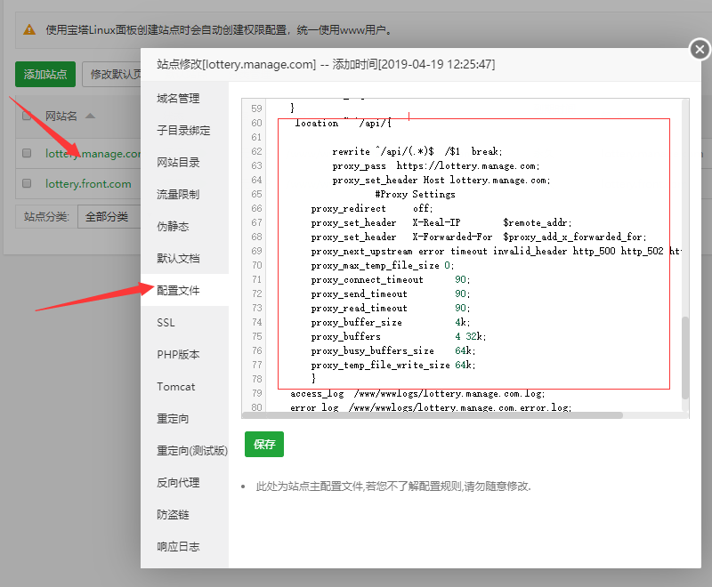

# Linux常用操作

<a href="#1">第一段</a>

## 1、Vagrant中的Linux 


Vagrant是简便虚拟机操作的一个软件
### 1.1、使用Vagrant虚拟机的好处：

* 1、为了开发环境与生产环境一致（很多开发环境为windows而生产环境为linux），不至于出现在开发环境正常而移步到正式生产环境时出现各种问题，而vagrant通过共享文件，可以实现在主机（windows）下的IDE编写代码操作，直接在虚拟机（linux）中运行展示出效果。

*  2、在vagrant中只需要搭配一次开发环境，然后就可以将搭配好的环境系统镜像打包发送给其他的同事用了，其他同事只需要下载vagrant和virtualBox，然后配置下共享目录后就可以开发了，再也不需要关心配置环境的问题了。

*  3、目前好多扩展如swoole、redis等对linux支持更好，甚至有些只支持linux，所以采用虚拟机，再也不需要为学习新技术找借口了。
相关环境机软件版本：主机：win10；虚拟机：CentOS 7.2 x86_64；vagrant：2.0.3；virtualBox：5.2.8

### 1.2、安装Vagrant虚拟的步骤如下：
 - 1、[下载virtualBox](https://www.virtualbox.org/)，安装
 - 2、[下载vagrant](https://www.vagrantup.com/downloads.html)，安装
 - 3、下载镜像，http://cloud.centos.org/centos/8/vagrant/x86_64/images/CentOS-8-Vagrant-8.4.2105-20210603.0.x86_64.vagrant-virtualbox.box，
 - 4、将下载的镜像加载，顺便说下，第3步可以不用，vagrant支持在线安装镜像，但由于长城的原因，所以最好通过其它方法将镜像下载下来,
 这里用的是磁盘扩展到100G的容量的BOX。再在本地加载,打开cmd，输入以下命令：
 
 ```
 C:\Users\86138>d:
 D:\>mkdir vmhost
 D:\>cd vmhost
 D:\vmhost>vagrant box add {title} {url}
 D:\vmhost>vagrant init {title}
 D:\vmhost>vagrant up

 ```
  - 5、上面命令的实例

```
 C:\Users\86138>d:
 D:\>mkdir vmhost
 D:\>cd vmhost
 D:\vmhost>mkdir centos8.4
 D:\vmhost>cd centos8.4
 D:\vmhost\centos8.4>vagrant box add centos8-4 D:\vswork\Tools\vmbox\CentOS-8-Vagrant-8.4.2105-20210603.0.x86_64.vagrant-virtualbox.box
 ==> box: Box file was not detected as metadata. Adding it directly...
==> box: Adding box 'centos8-4' (v0) for provider:
    box: Unpacking necessary files from: file:///D:/vswork/Tools/vmbox/CentOS-8-Vagrant-8.4.2105-20210603.0.x86_64.vagrant-virtualbox.box
    box:
==> box: Successfully added box 'centos8-4' (v0) for 'virtualbox'!

 D:\vmhost\centos8.4>vagrant init centos8-4 
 A `Vagrantfile` has been placed in this directory. You are now
ready to `vagrant up` your first virtual environment! Please read
the comments in the Vagrantfile as well as documentation on
`vagrantup.com` for more information on using Vagrant.
 
 D:\vmhost\centos8.4>vagrant up
```
 正常启动会出现下列信息

 ```
 Bringing machine 'default' up with 'virtualbox' provider...
==> default: Importing base box 'centos8-4'...
==> default: Matching MAC address for NAT networking...
==> default: Setting the name of the VM: centos84_default_1629013655391_64525
==> default: Clearing any previously set network interfaces...
==> default: Preparing network interfaces based on configuration...
    default: Adapter 1: nat
==> default: Forwarding ports...
    default: 22 (guest) => 2222 (host) (adapter 1)
==> default: Booting VM...
==> default: Waiting for machine to boot. This may take a few minutes...
    default: SSH address: 127.0.0.1:2222
    default: SSH username: vagrant
    default: SSH auth method: private key
    default:
    default: Vagrant insecure key detected. Vagrant will automatically replace
    default: this with a newly generated keypair for better security.
    default:
    default: Inserting generated public key within guest...
    default: Removing insecure key from the guest if it's present...
    default: Key inserted! Disconnecting and reconnecting using new SSH key...
==> default: Machine booted and ready!
==> default: Checking for guest additions in VM...
    default: No guest additions were detected on the base box for this VM! Guest
    default: additions are required for forwarded ports, shared folders, host only
    default: networking, and more. If SSH fails on this machine, please install
    default: the guest additions and repackage the box to continue.
    default:
    default: This is not an error message; everything may continue to work properly,
    default: in which case you may ignore this message.
==> default: Rsyncing folder: /cygdrive/d/vmhost/centos8.4/ => /vagrant
 ```

### 1.3、进入Vagrant Linux虚拟的步骤如下：
打开cmd（命令行/终端），输入以下命令：

```
D:\vmhost>vagrant ssh
[vagrant@10 ~]$

[vagrant@10 ~]$ su root
Password:
vagrant

[vagrant@10 vagrant]#
```
命令提示符说明：
  * ">vagrant ssh"中的 “>” 是dos(win10终端)的命令提示符，
  * “$” 是Unix/类Unix(Linux)中普通用户命令提示符
  * “#" 是Unix/类Unix(Linux)中系统管理用户命令提示符

#### 1.3.1、共享目录配置1：
 - 创建/www/web/works 备用
```
[root@10 vagrant]# cd /
[root@10 /]# mkdir www
[root@10 /]# cd www/
[root@10 www]# mkdir web
[root@10 www]# cd web
[root@10 web]# mkdir works
[root@10 web]# cd works
[root@10 works]# pwd
/www/web/works  
```


#### 1.3.2、从Linux虚拟退出到vagrant的步骤如下：
```
[vagrant@10 vagrant]# halt     $关闭linux

Connection to 127.0.0.1 closed by remote host.
Connection to 127.0.0.1 closed.

D:\vmhost>vagrant halt
==> default: Attempting graceful shutdown of VM...
    default: Guest communication could not be established! This is usually because
    default: SSH is not running, the authentication information was changed,
    default: or some other networking issue. Vagrant will force halt, if
    default: capable.
==> default: Forcing shutdown of VM...
```
#### 1.3.3、共享目录配置2，网络配置：
 - 在D盘根目录下创建一个目录：vagrant_work
 - 用文本编辑器打开D:\vmhost\centos8.4\Vagrantfile,在文件中添加下列一行：
 
 ```
  // ../../vagrant_work  ../../是相对于D:\vmhost\centos8.4\Vagrantfile
  config.vm.synced_folder "../../vagrant_work","/www/web/works" 

  config.vm.network "forwarded_port", guest: 80, host: 8080
  config.vm.network "private_network", ip: "192.168.33.10"
 ```
 上方相当与windows下的D:\>vagrant_work文件夹对应linux下的/www/web/works文件夹
####  1.3.4、启动中出现‘vboxsf’
当在启动中报mount: /www/web/works: unknown filesystem type 'vboxsf'.错误，虽然能正常启动，
但：
```
[root@10 works]# ls
是不能显示D:\>vagrant_work\中的内容的。
```
 - 解决方案
 
 ```
 D:\vmhost\centos8.4>vagrant plugin install vagrant-vbguest
 D:\vmhost\centos8.4>vagrant reload
 D:\vmhost\centos8.4>vagrant ssh
 [vagrant@10 ~]$ su root
Password:
[root@10 vagrant]# cd /
[root@10 /]# cd www/web/works/
[root@10 works]# ls
javapro  nodepro
 ```
####  1.3.5、虚拟机扩展磁盘、根目录
#####  1.3.5.1、先检查当前容量
```
[root@10 works]# df -hl
Filesystem      Size  Used Avail Use% Mounted on
devtmpfs        216M     0  216M   0% /dev
tmpfs           233M     0  233M   0% /dev/shm
tmpfs           233M  3.4M  230M   2% /run
tmpfs           233M     0  233M   0% /sys/fs/cgroup
/dev/sda1        10G  3.9G  6.2G  39% /
www_web_works   932G   88G  845G  10% /www/web/works
tmpfs            47M     0   47M   0% /run/user/1000
```
#####  1.3.5.2、停止虚拟机
```
D:\vmhost\centos8.4>vagrant halt default
==> default: Attempting graceful shutdown of VM...
    default: Guest communication could not be established! This is usually because
    default: SSH is not running, the authentication information was changed,
    default: or some other networking issue. Vagrant will force halt, if
    default: capable.
==> default: Forcing shutdown of VM...
```
#####  1.3.5.3、转换镜像
```
D:\vmhost\centos8.4>c:
C:\Users\86138>cd C:\Users\86138\VirtualBox VMs\centos84_default_1629013655391_64525
C:\Users\86138\VirtualBox VMs\centos84_default_1629013655391_64525>VBoxManage clonehd "CentOS-8-Vagrant-8.4.2105-20210603.0.x86_64.vmdk" "CentOS-8-Vagrant-8.4.2105-20210603.0.x86_64.vdi" --format vdi
```
#####  1.3.5.4、扩展镜像，此处以扩展到500G为例
```
C:\Users\86138\VirtualBox VMs\centos84_default_1629013655391_64525>VBoxManage modifyhd "CentOS-8-Vagrant-8.4.2105-20210603.0.x86_64.vdi" --resize 512000 
```
#####  1.3.5.5、重新挂载磁盘到虚拟机，并启动虚拟机
```
C:\Users\86138\VirtualBox VMs\centos84_default_1629013655391_64525>VBoxManage storageattach CentOS-8-Vagrant-8.4.2105-20210603.0.x86_64 --storagectl "SATA Controller" --port 0 --device 0 --type hdd --medium CentOS-8-Vagrant-8.4.2105-20210603.0.x86_64.vdi

C:\Users\86138\VirtualBox VMs\centos84_default_1629013655391_64525>d:
D:\>cd vmhost
D:\vmhost>cd centos8.4
D:\vmhost\centos8.4>vagrant up
D:\vmhost\centos8.4>vagrant ssh

[vagrant@10 ~]$ su root
Password:
[root@10 vagrant]# fdisk -l
Disk /dev/sda: 10 GiB, 10737418240 bytes, 20971520 sectors
Units: sectors of 1 * 512 = 512 bytes
Sector size (logical/physical): 512 bytes / 512 bytes
I/O size (minimum/optimal): 512 bytes / 512 bytes
Disklabel type: dos
Disk identifier: 0x99540636

Device     Boot Start      End  Sectors Size Id Type
/dev/sda1  *     2048 20971519 20969472  10G 83 Linux

[root@10 vagrant]# fdisk /dev/sda  
a. 按p显示分区表，默认是 sda1 和 sda2。
  b. 按n新建主分区。
  c. 按p设置为主分区。
  d. 输入3设置为第三分区。
  e. 输入两次回车设置默认磁盘起始位置。
  f. 输入t改变分区格式
  g. 输入3选择第三分区
  h. 输入8e格式成LVM格式
  i. 输入w执行

[root@10 vagrant]# reboot
D:\vmhost\centos8.4>vagrant ssh
// 创建物理卷
```


####  1.3.6、删除虚机
最后，执行下面的命令可以彻底删除虚机，包括整个虚机文件：
```
vagrant destroy
```
### 1.4、使用宝塔Linux面板代替命令行：

#### 1.4.1、安装宝塔Linux面板

 - 1、在Linux的终端执行如下命令：

```
 #yum install -y wget && wget -O install.sh http://download.bt.cn/install/install_6.0.sh && sh install.sh

```
 - 2、宝塔Linux面板登录信息显示（本地vagrant）

```
上述安装程序执行完成后，
显示如下信息：（具体内容因人而异）
==================================================================
Congratulations! Installed successfully!
==================================================================
外网面板地址: http://117.175.187.168:8888/cd658603
内网面板地址: http://192.168.33.10:8888/cd658603
username: gm5yvygj
password: 6decd8c7
If you cannot access the panel,
release the following panel port [8888] in the security group
若无法访问面板，请检查防火墙/安全组是否有放行面板[8888]端口
==================================================================

```
如果上述信息没复制下来，在终端输入命令也能找回同样信息
```
#  /etc/init.d/bt default
```

#### 1.4.2、使用宝塔Linux面板 

  - 打开宝塔Linux面板：在浏览器地址栏粘贴：http://192.168.33.10:8888/e937db4e
  - 登录宝塔Linux面板：

```
  username: fihq9pmi
  password: cf99d8a1
  
```

---
```
Bt-Panel-URL: http://192.168.33.10:8888/462c7d08
username: jexcrsi4
password: ce87dc0c
Warning:
If you cannot access the panel, 
release the following port (8888|888|80|443|20|21) in the security group
==================================================================
Time consumed: 3 Minute!
```

#### 1.4.3、一键创建LNMP环境 
在此操作中，根据目前我们的项目，PHP选择7.0, 其他默认


### 1.5、创建站点：

宝塔Linux面板管理常用命令：[https://www.bt.cn/btcode.html](https://www.bt.cn/btcode.html)
FTP账号资料
用户：lottery_front_com
密码：dXexEi3y8Ndha5NN
 
---
##### 需准备的文件说明
 * cjq.tar.gz 是采集器 上传到服务器的home下，解压，npm i
 * djycpgk.zip是网站后台管理代码
 *  front.zip是网站前台代码
 *  sb28_.sql是mysql数据库备份数据，在bt中导入
 
---
#### 1.5.1、添加网站


实例: 众筹后台：
FTP用户名  
   gk_test1_com
密码  
   n5D5ApwfsHbHjsX7


#### 1.5.2、 站点服务器配置文件

```
server
{
    listen 80;
	listen 443 ssl http2;
    server_name 7988z.com 6988z.com m.589ty.cn m.fmf3.cn m.fma2.cn 1699z.com 1299z.com 2988z.com;
    index index.php index.html index.htm default.php default.htm default.html;
    root /www/wwwroot/qt;
    
    #SSL-START SSL相关配置，请勿删除或修改下一行带注释的404规则
    #error_page 404/404.html;
    ssl_certificate    /etc/letsencrypt/live/7988z.com/fullchain.pem;
    ssl_certificate_key    /etc/letsencrypt/live/7988z.com/privkey.pem;
    ssl_protocols TLSv1 TLSv1.1 TLSv1.2;
    ssl_ciphers ECDHE-RSA-AES128-GCM-SHA256:HIGH:!aNULL:!MD5:!RC4:!DHE;
    ssl_prefer_server_ciphers on;
    ssl_session_cache shared:SSL:10m;
    ssl_session_timeout 10m;
    error_page 497  https://$host$request_uri;


    #SSL-END
    
    #ERROR-PAGE-START  错误页配置，可以注释、删除或修改
    error_page 404 /404.html;
    error_page 502 /502.html;
    #ERROR-PAGE-END
    
    #PHP-INFO-START  PHP引用配置，可以注释或修改

	include enable-php-00.conf;
    #PHP-INFO-END
    
    #REWRITE-START URL重写规则引用,修改后将导致面板设置的伪静态规则失效
    include /www/server/panel/vhost/rewrite/7988z.com.conf;
    #REWRITE-END
    
    #禁止访问的文件或目录
    location ~ ^/(\.user.ini|\.htaccess|\.git|\.svn|\.project|LICENSE|README.md)
    {
        return 404;
    }
    
    #一键申请SSL证书验证目录相关设置
    location ~ \.well-known{
        allow all;
    }
    
    location ~ .*\.(gif|jpg|jpeg|png|bmp|swf)$
    {
        expires      30d;
        error_log off;
        access_log /dev/null; 
    }
    location ~ .*\.(js|css)?$
    {
        expires      12h;
        error_log off;
        access_log /dev/null; 
    }
    
        location ~ ^/api/{
        	
        	rewrite ^/api/(.*)$  /$1  break;
            proxy_pass  https://xxxx.362e.cn;
            proxy_set_header Host xxxx.362e.cn;
                    #Proxy Settings
        proxy_redirect     off;
        proxy_set_header   X-Real-IP        $remote_addr;
        proxy_set_header   X-Forwarded-For  $proxy_add_x_forwarded_for;
        proxy_next_upstream error timeout invalid_header http_500 http_502 http_503 http_504;
        proxy_max_temp_file_size 0;
        proxy_connect_timeout      90;
        proxy_send_timeout         90;
        proxy_read_timeout         90;
        proxy_buffer_size          4k;
        proxy_buffers              4 32k;
        proxy_busy_buffers_size    64k;
        proxy_temp_file_write_size 64k;
        }
   
	access_log  /www/wwwlogs/7988z.com.log;
    error_log  /www/wwwlogs/7988z.com.error.log;
}

```
众筹前台：
1299z.com
7988z.com


#### 1.5.3、 在linux的做hosts映射
/etc/hosts
```
192.168.33.10  xxxx.xxxx.com #网站后台 lottery.front.com
192.168.33.10  xxxx.xxxx.com #网站前台  lottery.manage.com
```
备注：测试域名需要，有正式域名无须此步

#### 1.5.4、在宿主机win10中做hosts映射
C:\Windows\System32\drivers\etc\hosts
```
192.168.33.10  xxxx.xxxx.com #网站后台 lottery.front.com
192.168.33.10  xxxx.xxxx.com #网站前台 lottery.manage.com
```
备注：测试域名需要，有正式域名无须此步

#### 1.5.5、 在bt面板中做反向代理
  * 步骤一、

 


  * 步骤二、

 


  * 步骤三 、后台站点的伪静态中粘贴如下代码：
```
location / {
	if (!-e $request_filename){
		rewrite  ^(.*)$  /index.php?s=$1  last;   break;
	}
}
```

  * 步骤四、在配置文件中添加如下代码： 

```
 location ~ ^/api/{
        	
        	rewrite ^/api/(.*)$  /$1  break;
            proxy_pass  http://xxxx.xxxx.com;
            proxy_set_header Host xxxx.xxxx.com;
                    #Proxy Settings
        proxy_redirect     off;
        proxy_set_header   X-Real-IP        $remote_addr;
        proxy_set_header   X-Forwarded-For  $proxy_add_x_forwarded_for;
        proxy_next_upstream error timeout invalid_header http_500 http_502 http_503 http_504;
        proxy_max_temp_file_size 0;
        proxy_connect_timeout      90;
        proxy_send_timeout         90;
        proxy_read_timeout         90;
        proxy_buffer_size          4k;
        proxy_buffers              4 32k;
        proxy_busy_buffers_size    64k;
        proxy_temp_file_write_size 64k;
        }
```

### 1.6、centos7下卸载宝塔面板软件
```
# service bt stop && chkconfig –del bt && rm -f /etc/init.d/bt && rm -rf /www/server/panel
```
---
<a name="1">第一段</a>