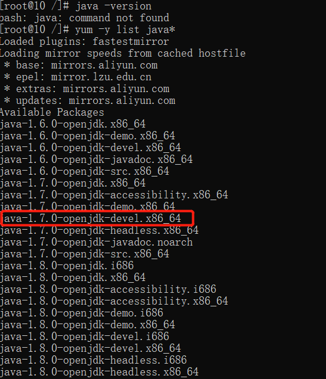

# Linux开发环境搭建
## 1、centos7用yum安装java8
 - 1.查看yum源中是否有相关套件yum -y list java*
 
 - 2.执行下列命令
 ```
  yum -y install java-1.8.0-openjdk-devel.x86_64
 ```
 - 3.修改/etc/profile并且source /etc/profile

 ```
  # vi /etc/profile    $打开后添加如下内容：

  JAVA_HOME=/usr/lib/jvm/java-1.8.0-openjdk-1.8.0.181-3.b13.el7_5.x86_64
  JRE_HOME=$JAVA_HOME/jre
  PATH=$PATH:$JAVA_HOME/bin
  CLASSPATH=.:$JAVA_HOME/lib/dt.jar:$JAVA_HOME/lib/tools.jar
  export JAVA_HOME
  export JRE_HOME
  export PATH
  export CLASSPATH

  [esc], [shift]+[:] wq!

  [root@10 /]# java -version
  openjdk version "1.8.0_302"
  OpenJDK Runtime Environment (build 1.8.0_302-b08)
  OpenJDK 64-Bit Server VM (build 25.302-b08, mixed mode)
  ```