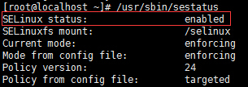
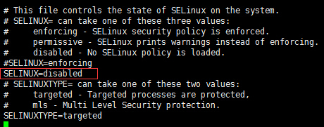

# Linux开发环境搭建

## 1、Go的安装

* 1、下载

访问[下载地址](https://studygolang.com/dl)，找到Linux下的最新稳定版本。鼠标右击复制链接：https://studygolang.com/dl/golang/go1.12.4.linux-amd64.tar.gz  

* 2、安装

打开终端在命令运行：
```
cd /usr/local/
mkdir apps       #创建安装目录 
cd apps
wget https://studygolang.com/dl/golang/go1.12.4.linux-amd64.tar.gz
tar -xvf go1.12.4.linux-amd64.tar.gz

创建工作目录 ，这里以vagrant环境为例，非vagrant的linux可创建 /data/goworks/src
cd /vagrant_data/  # cd /www/wwwroot/
mkdir goworks/src -p && cd goworks/src
```

* 3、设置环境变量

```
vim /etc/profile
```

添加:

```
export GOROOT=/usr/local/apps/go
export GOPATH=/www/wwwroot/goworks #export GOPATH=/vagrant_data/goworks  
export PATH=$PATH:$GOROOT/bin
export PATH=$PATH:$GOPATH/bin
```
保存:  
esc  
:wq  

假定你想要安装Go的目录为 $GOROOT。  
工作开发目录： $GOPATH  

* 4、验证Go环境是否搭建成功

```
cd /vagrant_data/goworks/src
mkdir helloworld && cd helloworld
vim main.go

添加如下代码：
package main
 
import "fmt"
 
func main() {
    fmt.Println("Hello, World!")
}
```
然后执行

```
go run ./main.go
```

如果报： bash: go: command not found

```
export PATH=$PATH:/usr/local/apps/go/bin
```

## 2、Go Web部署报错
### 2.1、Nginx 出现 403 Forbidden 的解决办法
引起nginx 403 forbidden通常是三种情况：

* 一是缺少索引文件，

* 二是权限问题，

* 三是SELinux状态。

#### 2.1.1、缺少索引文件
缺少index.html或者index.php文件，  
就是配置文件中index index.html index.htm这行中的指定的文件。 

```
server {  
  listen       80;  
  server_name  localhost;  
  index  index.php index.html;  
  root  /data/www/;
}
```
如果在/data/www/下面没有index.html,index.htm的时候，直接文件，会报403 forbidden。


#### 2.1.2、权限问题，如果nginx没有web目录的操作权限，也会出现403错误。
解决办法：修改web目录的读写权限，或者是把nginx的启动用户改成目录的所属用户，  
重启Nginx即可解决
```
chmod -R 777 /data
chmod -R 777 /data/www/
```
#### 2.1.3、SELinux设置为开启状态（enabled）的原因。
* 1、查看当前selinux的状态。  

```
/usr/sbin/sestatus
```


* 2、将SELINUX=enforcing 修改为 SELINUX=disabled 状态。

```
vi /etc/selinux/config  

#SELINUX=enforcing
SELINUX=disabled
```



* 3、重启生效。reboot。  

```
reboot
```
我这里出现错误的问题就是在第三步设置SELinux的问题上，折腾我好长时间。  
简单的三个步骤轻松的解决Nginx出现403 forbidden (13: Permission denied)报错的问题。