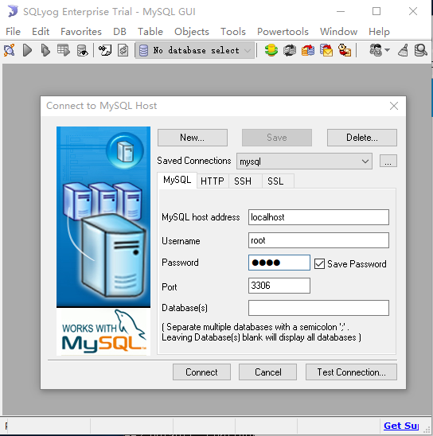

# Linux开发环境搭建
## 1、MySQL的安装

### 1.1、开机启动设置
```
#systemctl enable mysqld
#systemctl daemon-reload
```
## 2、SQLyog远程链接Linux服务器的MySQL
### 2.1、 下载SQLyog
 官网[下载](https://sqlyog.en.softonic.com/)
### 2.2、 安装SQLyog
### 2.3、 连接到远程服务器上的MySQL



## 3、错误
### 3.1、10060 错误 
  **报错：** Can't connect to MySQL server on '192.168.33.10' （10060）
  **解决：** 
  * 1、修改MySQL配置文件/etc/my.conf
```
# vim /etc/my.conf
将行：
bind-address    = 127.0.0.1
修改为：
bind-address    = 0.0.0.0
```
  * 2、MySQL创建用户、授权
```
# mysql -u root -p
Enter password:
 mysql> create user 'root'@'%' identified by 'root';
远程登录的话，将"localhost"改为"%"，表示在任何一台电脑上都可以登录

 mysql>grant all on quant.* to 'root'@'%' identified by 'root';
 mysql>flush privileges;
 ```
### 3.1、ERROR 1045 
 重置密码解决MySQL for Linux错误  
 ERROR 1045 (28000): Access denied for user 'root'@'localhost' (using password: YES)  

一般这个错误是由密码错误引起，解决的办法自然就是重置密码。  

假设我们使用的是root账户。  
1.重置密码的第一步就是跳过MySQL的密码认证过程，方法如下：  
```

#vim /etc/my.cnf(注：windows下修改的是my.ini)
```
在文档内搜索mysqld定位到[mysqld]文本段：
/mysqld(在vim编辑状态下直接输入该命令可搜索文本内容)

在[mysqld]后面任意一行添加“skip-grant-tables”用来跳过密码验证的过程，如下图所示：

```
explicit_defaults_for_timestamp=true
skip-grant-tables
```

保存文档并退出：
```
#:wq
```
2.接下来我们需要重启MySQL：
```
service mysqld restart
```
3.重启之后输入#mysql即可进入mysql。

```
#mysql
mysql>
```
4.接下来就是用sql来修改root的密码
```
mysql> use mysql;
mysql> update  mysql.user set authentication_string=PASSWORD("你的新密码") where user="root";

 update mysql.user set authentication_string=PASSWORD('root') where user='root';
 
mysql> flush privileges;
mysql> quit
```
到这里root账户就已经重置成新的密码了。


5.编辑my.cnf,去掉刚才添加的内容，然后重启MySQL。大功告成！
```
#explicit_defaults_for_timestamp=true
#skip-grant-tables
```