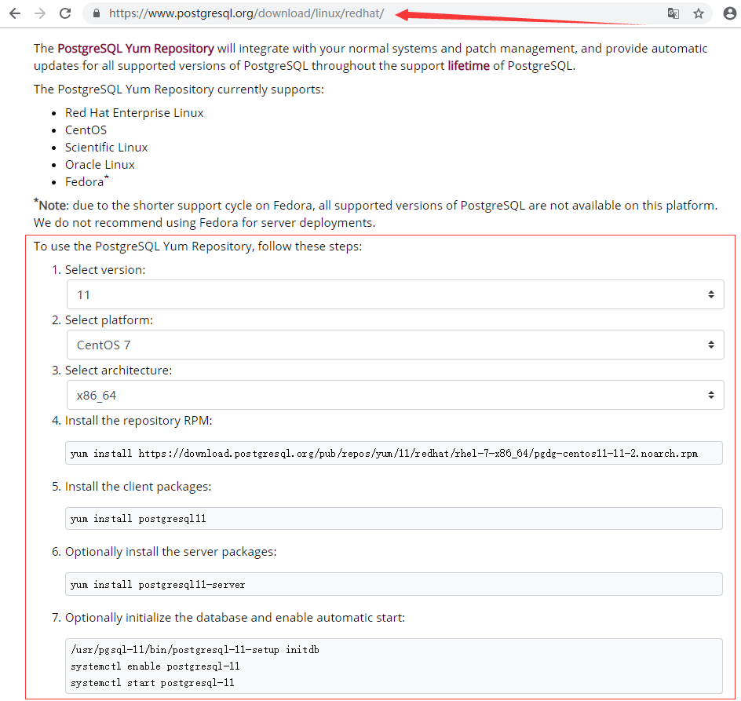

# Linux开发环境搭建
## Postgresql的安装

### 1、Postgresql的安装步骤
进入[官网](https://www.postgresql.org/download/linux/redhat) 

#### 1.1、Select version（选择版本）：
```
11
```
#### 1.2、Select platform（选择平台）：
```
CentOS 7
```
#### 1.3、Select architecture（选择体系结构）:
```
X86_64
```
#### 1.4、Install the repository RPM（安装存储库RPM）:
从这步开始，打开终端复制命令，在终端运行
```
#yum install https://download.postgresql.org/pub/repos/yum/11/redhat/rhel-7-x86_64/pgdg-centos11-11-2.noarch.rpm
```
#### 1.5、Install the client packages（安装客户端包）:
```
# yum install postgresql11
```
#### 1.6、Optionally install the server packages（可选安装服务器包）:
```
# yum install postgresql11-server
```
#### 1.7、Optionally initialize the database and enable automatic start（可以选择初始化数据库并启用自动启动）:
```
# /usr/pgsql-11/bin/postgresql-11-setup initdb
# systemctl enable postgresql-11
# systemctl start postgresql-11
```


#### 1.8、开放防火墙端口
```
firewall-cmd --permanent --add-port=5432/tcp  
firewall-cmd --permanent --add-port=80/tcp  
firewall-cmd --reload  
```
#### 1.9、访问PostgreSQL
**1、进入PostgresSQL**
```
su - postgres
Last login: Fri Apr 26 09:58:46 CST 2019 on pts/0
-bash-4.2$
```
**2、查看PostgrSQL的版本信息**  
 输入命令psql将看到PostgrSQL的版本信息。
```
-bash-4.2$ psql
psql (11.2)
Type "help" for help.

postgres=#
```
**3、查看帮助信息**  

输入 "help" 来获取帮助信息. 

```
postgres=# help
You are using psql, the command-line interface to PostgreSQL.
Type:  \copyright for distribution terms
       \h for help with SQL commands
       \? for help with psql commands
       \g or terminate with semicolon to execute query
       \q to quit
postgres=#

```
**4、退出PostgresSQL**
```
postgres=# \q
-bash-4.2$ exit;
```

#### 1.10、postgres帐号密码
postgres帐号密码 都为postgres

---

### 2、开启远程访问

#### 2.1、修改配置文件postgresql.conf
```
vim /var/lib/pgsql/11/data/postgresql.conf
```
##### 2.1.1、修改listen_addresses
修改#listen_addresses = 'localhost'  为  listen_addresses='*'  
当然，此处‘*’也可以改为任何你想开放的服务器IP  
 
##### 2.1.2、编辑pg_hba.conf配置文件
在里面添加：
```
vim /var/lib/pgsql/11/data/pg_hba.conf 
host    all             all             0.0.0.0/0               trust
```
#### 2.3、重启服务器
```
systemctl restart postgresql-11.service
```
---
### 3、备份
```
pg_dump -h 192.168.33.10 -U postgres issuetracker >  /www/web/node_pro/koatopro/issuetracker.bak
```
---
### 4、恢复
```
psql -h ip -U postgres -d issuetracker < issuetracker.bak
```
---
### 5、错误：
#### 5.1、错误：
**pq: Ident authentication failed for user "root" Cannot create user** 

**解决：**
```
vim /var/lib/pgsql/11/data/pg_hba.conf
```
将：
```
# IPv6 local connections:
host    all             all             ::1/128                 Ident
                                                                  
修改为：
# IPv6 local connections:
host    all             all             ::1/128                 trust
```

#### 5.2、错误：
pq: role "root" does not exist  

**解决：**
```
su postgres

# 创建root用户
postgres=#create user root with password 'password';    
CREATE ROLE

# 将数据库权限赋予root用户
postgres=# GRANT ALL PRIVILEGES ON DATABASE mydatabase to root;
GRANT

# 将用户修改为超级用户（看实际需求）
postgres=# ALTER ROLE root WITH SUPERUSER;

postgres=# \q
```
