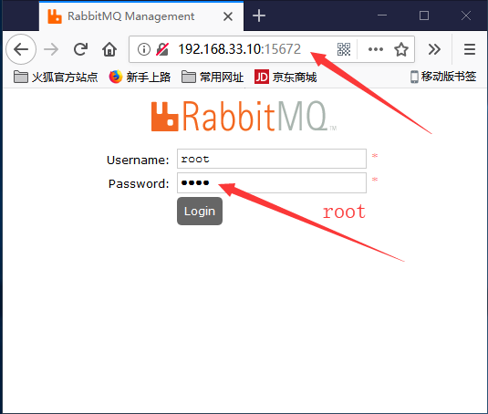

# Linux开发环境搭建
## RabbitMQ的安装

### 1、准备基础编译环境
打开终端运行下列安装命令：
```
# yum -y install make gcc gcc-c++ glibc-devel kernel-devel m4 ncurses-devel openssl-devel xmlto

```
### 2、下载相关软件包
打开终端运行下列安装命令：
```
# cd /usr/local
```
#### 2.1、下载RabbitMQ
* 到[RabbitMQ官网](http://www.rabbitmq.com/install-rpm.html)[选择最新版本](https://dl.bintray.com/rabbitmq/all/rabbitmq-server/)，点击鼠标右键，复制链接。  

打开终端运行下列安装命令：  

```
# wget https://dl.bintray.com/rabbitmq/all/rabbitmq-server/3.7.5/rabbitmq-server-3.7.5-1.el7.noarch.rpm
```
#### 2.2、下载Erlang
* 到[Erlang官网](http://www.erlang.org)[选择最新版本](http://erlang.org/download/)，点击鼠标右键，复制链接。
打开终端运行下列安装命令：  

```
# wget http://erlang.org/download/otp_src_20.3.tar.gz
```
### 3、安装
#### 3.1、先安装ErLang

##### 3.1.1、解压安装ErLang
```
tar xzf otp_src_20.3.tar.gz
cd otp_src_20.3
sudo mkdir -p /usr/local/erlang
sudo ./configure --prefix=/usr/local/erlang --without-javac
sudo make 
make install
```
##### 3.1.2、配置Erlang环境变量
```
# vim /etc/profile

#打文件后，追加环境变量到文件末尾:

ERL_HOME=/usr/local/erlang
PATH=$ERL_HOME/bin:$PATH
export ERL_HOME PATH
```
按[Esc]键  
:wq!  
保存退出 （设置环境变量后，要重新打开终端）

```
# source /etc/profile
```
#### 3.2、安装RabbitMQ
##### 3.2.1、安装RabbitMQ
```
cd ..
rpm -ivh --nodeps rabbitmq-server-3.7.5-1.el7.noarch.rpm
```

##### 3.2.2、运行RabbitMQ需要首先开放15672和5672端口

```
 sudo firewall-cmd --zone=public --add-port=15672/tcp --permanent
 sudo firewall-cmd --zone=public --add-port=5672/tcp --permanent
 sudo firewall-cmd --reload  
```
##### 3.2.3、测试RabbitMQ经安装是否成功
 正常情况下RabbitMQ已经安装完成，最后测试一下：

 ``` 
 rabbitmq-plugins enable rabbitmq_management
 rabbitmq-server
 ```

正常启动以后，我们可以在本地使用浏览器中访问管理页面：  
http://192.168.3.10:15672/  

##### 3.2.4、为RabbitMQ创建用户并赋权
 至此，我们的准备工作已经完成了80%。接下来我们需要为RabbitMQ创建用户并赋权。  
```
 rabbitmqctl add_user root root
 rabbitmqctl set_user_tags root administrator
 rabbitmqctl set_permissions -p / root '.*' '.*' '.*'
```
后台启动  
```
rabbitmq-server -detached
```

重新通过在本地浏览器访问管理页面，http://192.168.3.10:15672/ 
  
输入用户名和密码(全是root)。

##### 3.2.5、设置开机自启动
```
ln -s $(which erl) /usr/bin/erl && chkconfig rabbitmq-server on
ln -s $(which erl) /usr/bin/erl && systemctl enable rabbitmq-server.service
```

##### 3.2.6、rabbitmq启动/停止
```
/sbin/service rabbitmq-server start
/sbin/service rabbitmq-server stop
```
---
### 4、报错
报TypeError: Cannot read property 'createChannel' of undefined错  
是指还有启动rabbitmq-server  

**报错：**  
可能会遇到Error when reading /var/lib/rabbitmq/.erlang.cookie: eacces（这是因为没有权限的问题）  

**解决办法：** 
执行语句：  
chown rabbitmq:rabbitmq /var/lib/rabbitmq/.erlang.cookie

---

### 5、安装方法二

yum install erlang

wget https://dl.bintray.com/rabbitmq/all/rabbitmq-server/3.7.6/rabbitmq-server-3.7.6-1.el7.noarch.rpm

rpm --import https://dl.bintray.com/rabbitmq/Keys/rabbitmq-release-signing-key.asc
yum install rabbitmq-server-3.7.6-1.el7.noarch.rpm


rpm --import https://www.rabbitmq.com/rabbitmq-release-signing-key.asc
yum install rabbitmq-server-3.7.6-1.el7.noarch.rpm


