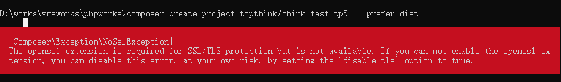

# Composer的安装和简单使用
## 1、准备工作        
1、在本地安装好WAMP环境，博主使用的是PHPStudy软件；

2、在PHP目录下，打开php.ini文件，开启openssl扩展（去掉extension=php_openssl.dll前面的分号）；

3、把php目录添加到环境变量（和php.exe同级目录的路径）如下图：执行php -v 命令看是否成功；
4、在官网下载Composer-Setup.exe文件：https://getcomposer.org/download/

## 开始安装Composer
 完成以后，输入"composer -V",显示一下画面说明安装成功
 ```
 composer -V
 Composer version 1.8.5 2019-04-09 17:46:47
 
 ```
## 使用Composer\
### 1、新建composer.json文件
 切换到项目目录“rest-data”，在该目录下载“gregwar/captcha”包，我们需要在该目录新建一个文件composer.json,里面的代码为
 ```
{
    "require": {
        "gregwar/captcha": "1.*"
    },
    
}
 ```
### 2、运行composer install
 然后将cmd定位rest-data目录，输入命令：
 ```
  composer install

  Loading composer repositories with package information
  Updating dependencies (including require-dev)
  Package operations: 2 installs, 0 updates, 0 removals
  - Installing symfony/finder (v4.2.8): Downloading (100%)
  - Installing gregwar/captcha (v1.1.7): Downloading (100%)
  Writing lock file
  Generating autoload files
 ```
 ### 3、更换镜像的命令
 下载速度如果慢的话，请更换镜像，更换镜像的命令
 ```
 composer config -g repo.packagist composer https://packagist.phpcomposer.com
 composer config repo.packagist composer https://packagist.phpcomposer.com
 ```

 ## 2、搭建ThinkPHP5.1
 ### 2.1、使用Composer安装
 ```
  composer create-project topthink/think linux-php-tp5 
  composer create-project topthink/think test-tp5  --prefer-dist
 ```
 #### 2.1.1、如使用过程中报如下错误 
 
 ```
 解决方法：在php.ini文件中打开php_openssl扩展 
 extension=php_openssl.dll
```
 ### 2.2、使用phpstudy配置站点
 ### 2.3、访问站点
 ```
  http://127.0.0.1:8383/public/

```

## 3、win10 apache2.4 php7.2 php7.3 开启openssl扩展
[官方下载](https://windows.php.net/downloads/php-sdk/deps/vc14/x64/)
[openssl-1.1.1c-vc14-x64.zip](https://windows.php.net/downloads/php-sdk/deps/vc14/x64/openssl-1.0.2r-vc14-x64.zip)
解压后bin目录能看到libcrypto-1_1-x64.dll和libssl-1_1-x64.dll，拷到php和apache的bin下