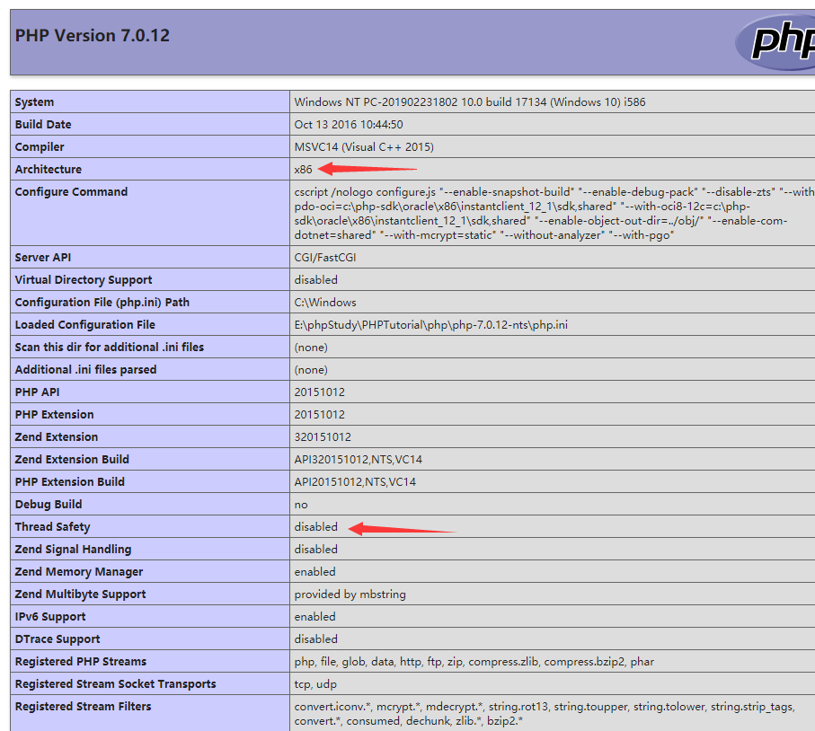
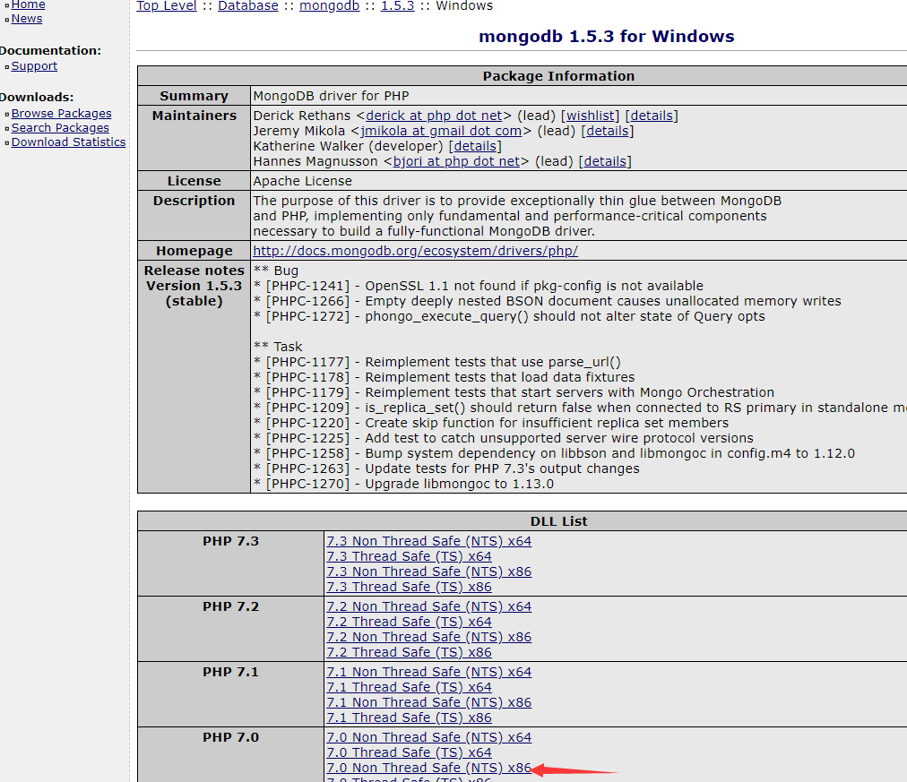

# 1、下载mongodb扩展
```
下载地址：
https://pecl.php.net/package/mongodb/1.5.3/windows
```
## 1.1、打开phpinfo检查当前系统结构（Architecture）及Thread Safety

## 1.2、打开上面下载地址链接进入

## 1.3、下载ph5.6 Non Thread Safe (NTS) x86 那个文件 与 phpinfo结构对应。


## 2、安装mongodb扩展

>下载好以后打开压缩包我们会发现php_mongodb.dll文件。
>将这个文件复制到“E:\phpStudy\PHPTutorial\php\php-7.0.12-nts\ext”这个路径的文件夹下面。

## 3、修改php.ini配置文件来让PHP加载这个扩展
```
找到你的php.ini编辑这个文件，添加
extension=php_mongodb.dll
```
