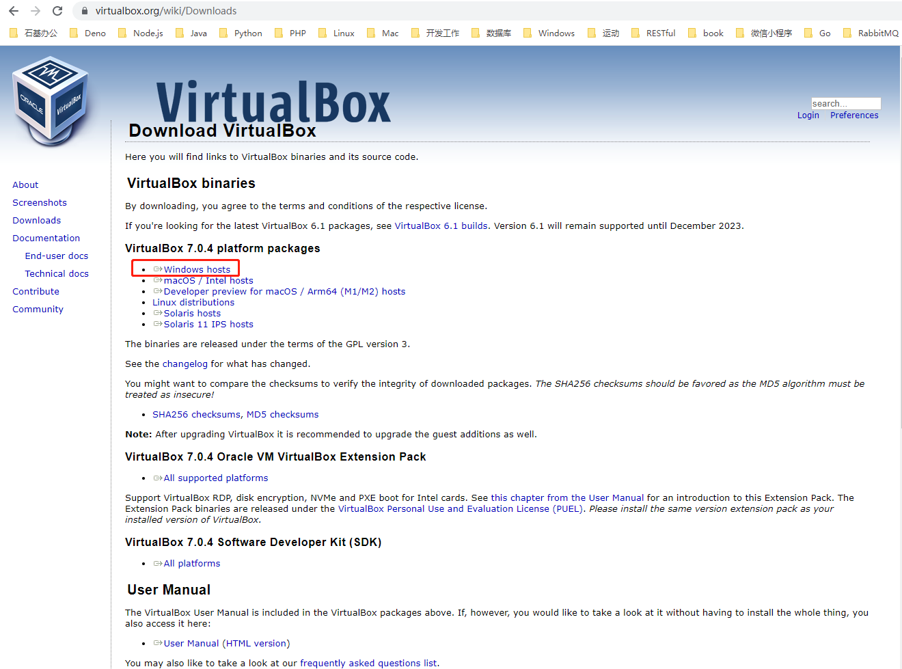
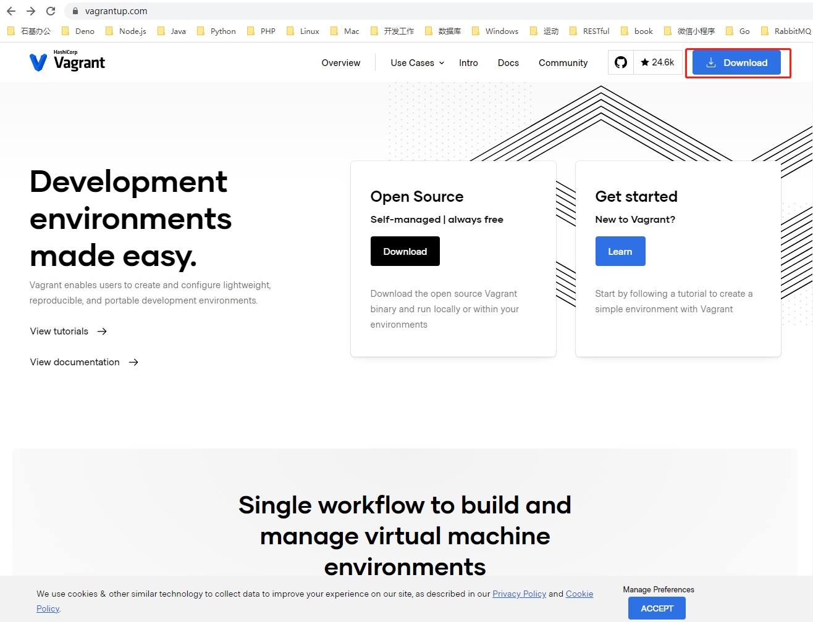
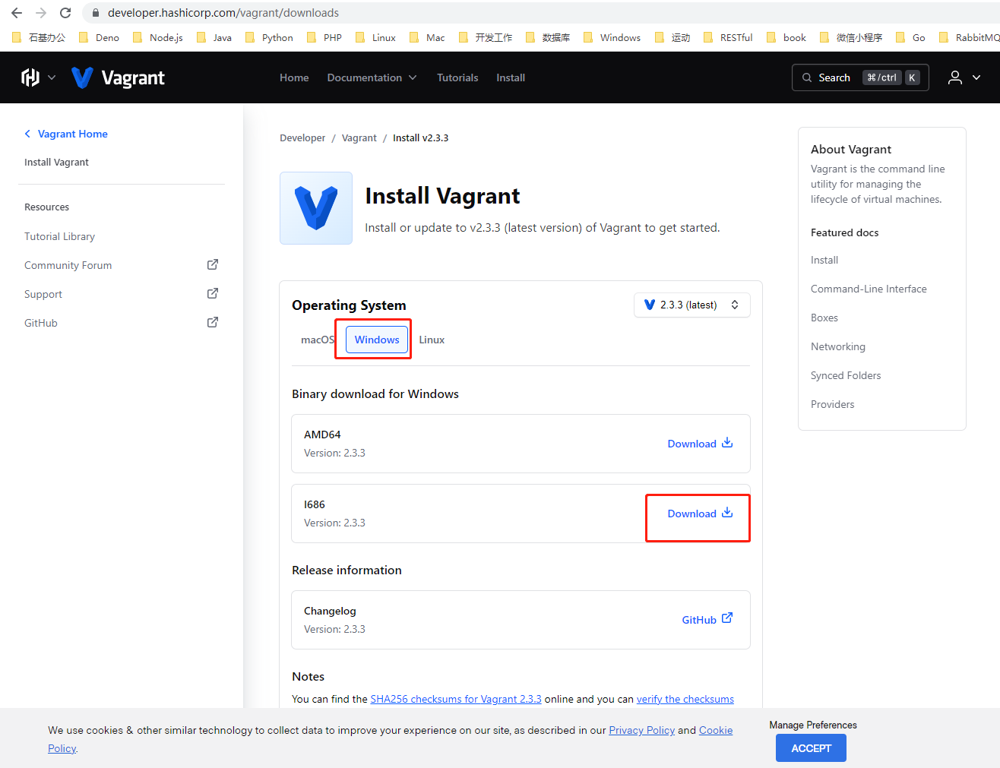
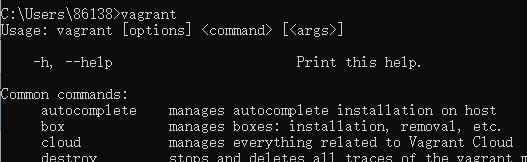
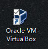
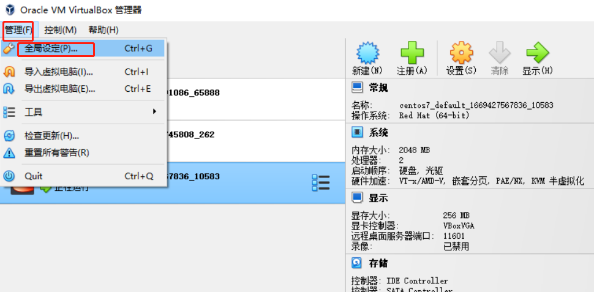
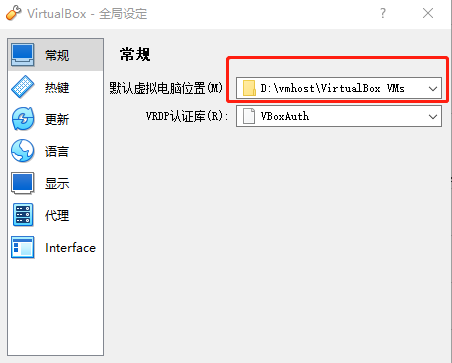

#  1、准备Vagrant环境

 - 1、下载virtualBox，地址点这里https://www.virtualbox.org/wiki/Downloads，点击如图下载
    
    安装
 
 - 2、下载vagrant，地址点这里https://www.vagrantup.com/，
    

    
 安装
 - 3 、验证vagrant是否安装成功
 ```
 [win] + [R]
 cmd
 在打开的命令提示符后输入：vagrant
 ```
 显示如下图：
 
 
 说明安装成功
 - 4、这一步主要是为了让你的C盘减负，一开始就将虚拟机放于其它比较大的盘上
     
     双此图标         
        
     启动 Oracle VM VirtualBox

    如下图打开全局设置      
    

    再如下图创建一个目录“VirtualBox VMs”用于存放后续创建的虚拟机   
    
 
 # 2、虚拟环境（项目）搭建

 ## 2.1、centOS环境的搭建

 ### 2.1.1、初始化项目目录
 - 1)、创建目录

 ```
    mkdir centos7
    cd centos7
 ```
 - 2)、打开https://app.vagrantup.com/boxes/search, 选择一个你需要的virtualbox
   这里我选择了centOS7.2

 - 3)、 初始化项目

 ```
    vagrant init generic/centos7

    A `Vagrantfile` has been placed in this directory. You are now
    ready to `vagrant up` your first virtual environment! Please read
    the comments in the Vagrantfile as well as documentation on
    `vagrantup.com` for more information on using Vagrant.
 ```
   出现上面一段话后，初始化完成

- 4)、 启动环境

```
  vagrant up
```

- 5)、用SSH连接到计算机

```
   vagrant ssh
```
出现如下提示 就可操作了
```
   [vagrant@centos7 ~]$
```
