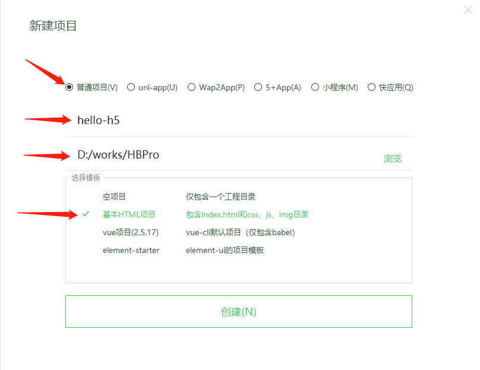
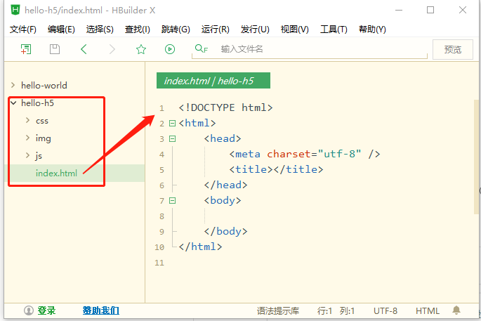

# HTML5
## 1、HTML5语法
### 1.1、工欲善其事必先利其器
#### 1.1.1、下载编辑器
[下载HBuilderX](http://www.dcloud.io/hbuilderx.html)
#### 1.1.2、解压直接运行

#### 1.1.3、创建项目


项目目录结构：


### 1.2、HTML基本结构

```
<!DOCTYPE html>
<html>
	<head>
		<meta charset="utf-8" />
		<title></title>
	</head>
	<body>
		
	</body>
</html>
```
结构解释：
#### 1.2.1、 &lt; !doctype html &gt;
> 文档声明语句，不是标签，只是用于声明, 告诉浏览器这是一个html文档仅此而已。

#### 1.2.2、 &lt;html&gt;&lt;/html&gt; 标签
> &lt;html&gt; 是html文档的开始标签  
 &lt;/html&gt; 是html文档的结束标签（注：比形始标签多了一个"/"斜杠）  
 Web页面就是由这对标签括起来的更多的标签组成的。  
 一个html文档分为 头部 和 主体 两个部份。

##### 1.2.2.1、 &lt;head&gt;&lt;/head &gt;标签
> &lt;head&gt;&lt;/head &gt; 这对标签括起的部份是html的头部, 提供关于网页的信息

##### 1.2.2.2、&lt;body &gt; &lt;/body &gt;标签
> &lt;body &gt; &lt;/body &gt;这对标签括起的部份是html的主体部份, 提供网页的具体内容。

#### 1.2.3、 名词术语
#### 1.2.3.1、HTML
> HTML是(Hyper Text Markup Language)的缩写，译为：超文本标记语言。HTML 不是一种编程语言，而是一种标记语言 (markup language)， “超文本”就是指页面内可以包含图片、链接，甚至音乐、程序等非文字元素。

#### 1.2.3.2、标签
> 标签，就是指的标记，也就是用尖括号&lt;  &gt; 括起来的符号。

#### 1.2.3.3、元素
> 用html标签包裹起来的内容。文本或标签。元素可嵌套（可以包括其他的HTML元素）

 #### 1.2.3.4、标签的属性
> 标签可以拥有属性，属性给标签提供更多信息  
属性总是以名称/值对的形式出现  
属性值始终被包括在引号内，双引/单引号

| 属性 名称 | 属性值 | 描述  |
| :--------------- | :---------------- | :---------|
| id | idname | 规定元素的唯一标识名（idname）|
| class | classname | 规定元素的类名（classname） |
| style | style_definition | 规定元素的行内样式（inline style）|
| title | text | 规定元素的额外信息（可在工具提示中显示）|
| alt | text | 规定元素的额外信息（可在工具提示中显示）|
| onclick | everntname | 规定元素的点击后执行的动作|

### 1.3、语义化的HTML5基本结构
```
<!DOCTYPE html>
<html>
	<head>
		<meta charset="utf-8" />
		<title></title>
	</head>
	<body>
		<header>
		  <nav> 
		  </nav>
		</header>

		<main>
			<article>
				<h1>HTML5学习之语义化标签</h1>
				<p>....正文.....</p>
				<section>
					<h1>HTML5学习之语义化标签</h1>
					<p>....正文.....</p>
				</section>
			</article>
		</main>

		<footer>

		</footer>
	</body>
</html>
```
 &lt; meta &gt;
 始终位于head元素中，标签提供关于HTML文档的元数据


<title></title>定义文档的标题


HTML标签
开始标签(opening tag):开放标签
结束标签(closing tag):闭合标签


元素
定义：HTML元素指的是从开始标签到结束标签的代码（元素以开始标签为起始以借宿标签终止）
元素的内容：元素的内容指的是开始标签与结束标签之间的内容

元素的特点：
1，大多数HTML元素可嵌套（可以包括其他的HTML元素）
2，HTML文档有嵌套的HTML元素构成
3，不要忘记结束标签，未来的HTML版本不允许省略结束标签
4，空的html元素
5，没有内容的html元素被称为元素的空内容，空元素是在开始标签中关闭的
注意：
空元素和空内容的区别：空元素的开始标签和结束标签是相同的，注重的是标签。空内容指的是元素内的内容是空的，注重的是内容。


HTML属性
html标签可以拥有属性，属性提供有关html元素的更多信息
属性总是以名称/值对的形式出现
属性值应该始终被包括在括号内，双引号是最常见的，不过使用单引号也没有问题

 


 

 HTML注释
可以在代码中插入注释，提高代码的可读性，注释不会显示在页面中，浏览器会忽略它们
格式：<!--this is a comment-->

 
 ```
<!doctype html>
<html>
<head>
<meta charset="utf-8">
<title>无标题文档</title>
<style>

#box1{
    background-color:red;
}
.div1{background:yellow;}
.div2{border:1px solid #000;}

</style>
</head>

<body>

<!-- id只能是唯一的 -->
<div style="width:100px; height:100px; border:1px solid #000;" id="box1 box2"></div>
 

<!--class可以是多个的-->
<div  style="width:100px; height:100px;"  class="div1 div2" ></div>

<!--class可以是多个的-->

<a href="#" title="我是一个提示信息">我是一个链接</a>

</body>
</html>
 ```