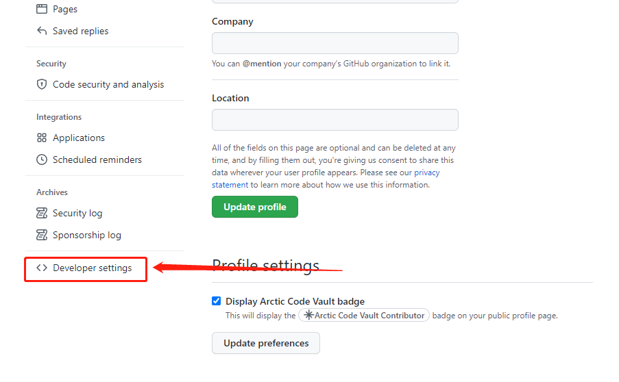

# 工具应用
## Git及github的应用
 * 1、CentOS 7 中安装Git
 * 2、github的应用

### 1、CentOS 7 中安装Git


#### 1.1、Git服务器端安装
##### 1.1.1、安装及创建仓库
 * 1.先从yum安装git
```
yum –y install git
```

 * 2.在需要的位置创建一个裸(空)仓库（最后以.git结尾）
```
cd /usr/local
mkdir git
cd git
git init --bare golangpro.git
```
 * 3.创建一个git用户并赋予密码
```
useradd git
passwd git
```
 * 4.赋予git用户权限
```
chown -R git:git golangpro.git
```

 * 5.禁用git用户shell登录（一定要禁用）

```
vi /etc/passwd  
##将git用户修改为如下（一般在最后一行）  
git:x:1000:1000::/home/git:/usr/bin/git-shell  
##其他的不用改。服务端完成。
```

##### 1.1.2、git init 与 git init --bare 的区别

 * **1、git init --bare**  
 > 使用命令**"git init --bare"**(bare汉语意思是:裸,裸的)初始化的版本库(暂且称为bare repository)只会生成一类文件:用于记录版本库历史记录的.git目录下面的文件;而不会包含实际项目源文件的拷贝;所以该版本库不能称为工作目录(working tree);如果你进入版本目录,就会发现只有.git目录下的文件,而没有其它文件;就是说,这个版本库里面的文件都是.git目录下面的文件,把原本在.git目录里面的文件放在版本库的根目录下面;换句话说,不使用--bare选项时,就会生成.git目录以及其下的版本历史记录文件,这些版本历史记录文件就存放在.git目录下;而使用--bare选项时,不再生成.git目录,而是只生成.git目录下面的版本历史记录文件,这些版本历史记录文件也不再存放在.git目录下面,而是直接存放在版本库的根目录下面

* **2、git init**  
 > 用"git init"初始化的版本库用户也可以在该目录下执行所有git方面的操作。但别的用户在将更新push上来的时候容易出现冲突。  
 比如有用户在该目录（就称为远端仓库）下执行git操作，且有两个分支(master 和 b1)，当前在master分支下。另一个用户想把自己在本地仓库（就称为本地仓库）的master分支的更新提交到远端仓库的master分支，他就想当然的敲了
```
git push origin master:master
```
于是乎出现,因为远端仓库的用户正在master的分支上操作，而你又要把更新提交到这个master分支上，当然就出错了。  

但如果是往远端仓库中空闲的分支上提交还是可以的，比如
```
git push origin master:b1   
```
还是可以成功的  


解决办法就是使用”git init –bare”方法创建一个所谓的裸仓库，之所以叫裸仓库是因为这个仓库只保存git历史提交的版本信息，而不允许用户在上面进行各种git操作，如果你硬要操作的话，只会得到下面的错误（”This operation must be run in a work tree”）  


这个就是**最好把远端仓库初始化成bare仓库**的原因。

#### 1.2、Git客户端安装

客户端为git for windows

 * 1.安装，略...

 * 2.进入想要将项目放置的目录

 * 3.创建用户
```
git config --global user.name "你的名字"
git config --global user.email "你的邮箱"
```
 * 4.创建秘钥（用来防止每次commit或push都需要密码）
```
ssh-keygen -t rsa -C "你的邮箱"
// 一直回车....
```
 * 5.将秘钥加入服务器列表

   - 5.1 取得公钥（本地）
```
在当前目录下(若未改变目录，到C:\Users\Administrator\.ssh\id_rsa.pub)找到.ssh目录下的id_rsa.pub文件，
使用notepad++或其他软件打开，复制其中内容（类似如下：  
ssh-rsa AAAAB3NzaC1yc2EAAAADAQABAAABAQCq+DNXnrzPoGJe3uCObDG7DcMMotWght/QNZnnO39FLzin+xMj+cOGpwbi5PSRqUwVrq4So7uuQGz2xyLb3vjHYK3z7SG/Sk/HdQctvbIVo+NugXbgmopm25Ps518aDuQ7w8nlPY3IvxTqH1U2ijoCdqgnVrwKCCPf7QY/2HGI+nDbF+s6cCX4CIkhwWnWhJXVqmSxbPSA8sX/2NE71gwhypLLfH8PG8nHr36zSfCdf0/DASdzJD7wE3cdlvICT82TmmqZLPWgYQv+4zNjbuPpzupp5zBIN+piS9VfBv+RdFEtx3oPk3Ou0z1tR9T5Lpe55b+U.......... 你的邮箱）
```
   - 5.2 将公钥加入服务器列表（服务器）
```
//CentOS 7默认列表在/root/.ssh/authorized_keys，
//使用vi 编辑此文件输入刚才复制的内容，保存退出。
vi /root/.ssh/authorized_keys
//i修改
//esc后输入:wq保存退出
```
   - 5.3 可以跳过此步，若克隆远程项目多次仍然需要密码，则检查上一步是否有错误，没有错误后，在配置这一步（服务器）在/home目录下创建.ssh目录，进入，创建authorized_keys文件
```
cd /home
mkdir .ssh
cd .ssh
vi authorized_keys
//加入我们的公钥后保存退出。
```


 * 6.克隆远程项目（本地）
```
cd F:
cd git
//把ip换成自己服务器的
git clone git@192.168.33.10:/usr/local/git/golangpro.git
```
 * 7.如果需要密码，输入你设置的git用户密码，若clone之后commit多此后仍然需要密码，执行5.3，若已经执行，检查公钥是否正确，然后退出git for windows，再此打开git for windows克隆

#### 1.3、git命令
##### 1.3.1、git常用命令
```
git add
添加提交任务到暂存区

git commit -m "commit info"
添加提交任务到版本库

git log
查看提交记录

git diff
查看工作区和暂存区的差异

git diff --cached
查看暂存区和版本库的差异

git diff HEAD
查看工作区和版本库的差异

git status -s
简短输出，第一个M表示暂存区和版本库内容不一致；
第二个M表示工作区和暂存区内容不一致

git checkout -- file.txt
把暂存区的file.txt文件恢复到工作区，覆盖工作区之前的修改。
checkout命令主要是把历史某个版本检出到工作区。慎用

git reset HEAD
暂存区的目录树被版本库里的内容重置，但是工作区不受影响。
放弃之前git add的提交。

git reset --hard SHA1号/HEAD
工作区和暂存区的目录树被版本库里的内容重置。
放弃之前git add和个git commit的提交。

git rm file.txt
删除文件

git blame file.txt
查看文件提交历史信息，方便定位bug

git show-ref
查看所包含的引用

git merge
进行合并操作

git push -u origin master
向远程版本库origin的master分支提交

git pull
把远程版本库的master分支拉到本地，数据同步服务器端

git tag -m "my first tag" mytagv1.0
制作里程碑

git cat-file tag mytagv1.0
查看mytagv1.0提交信息

git tag -l -n1
查看所有tag，n1显示一行信息

git tag -d mytagv1.0
删除tag

git branch newbranch
创建分支

git checkout newbranch
切换到newbranch分支

git branch -d newbranch
删除分支，如没合并，则失败

git branch -D newbranch
强制删除分支

git push origin :newbranch
先删除本地分支，再删除远程版本库对应分支

git show-ref
查看本地引用

git checkout -b hello-1 origin/hello-1
创建跟踪远程分支的本地分支，随后可以pull和push远程分支

git remote add new-remote file:///path/hello-1.git
创建远程版本库

git remote -v
查看远程版本库
```
##### 1.3.2、git分支命令
```
git branch -a
查看所有分支，含远程  

git branch
查看本地分支  

git branch -r
查看远程分支  

git branch newbranch
创建新分支  

git branch -d oldbranch
删除分支oldbranch  

git push origin newbranch
把新分支同步到远程仓库  

git push origin :oldbranch
删除远程oldbranch分支  

git checkout -b newbranch
切换到另一分支，如果不存在则创建  

git checkout branch
切换到另一分支  

git clone新项目时
无论当前项目在什么分支，都是下载默认master分支  

git checkout master
git merge anthorbranch
git push origin maste
合并开发分支到master分支  

git pull尽量少使用，隐含了合并信息
get featch 下载远程origin/master更新
git diff master origin/master
查看本地和远程库的区别  

get merge origin/master
合并远端更新到本地
```
###### 1.3.2.1、分支操作
```
1、第一步：
在当前分支 ：master_yg
git commit -m"commit master_yg"

2、第二步：
git checkout master

3、第三步：
在当前分支 ：master
git merge master_yg


4、第四步：
在当前分支 ：master 到 vs code
yarn build （构建生成dist目录）

5、第五步：
在当前分支 ：master
git add .
git commit -m""
git push

6、第六步：
创建并切换分支
git checkout -b branchName 
然后在branchName分支进行开发
```
###### 1.3.2.2、分支master到分支release操作
```
一、在项目目录中右击，选择“Git Bash Here”,进入git 命令行。
1、 git stash save 'lost-found-2021-07-30'
2、 git checkout release 
3、 git merge master
二、查看是否有冲突，在项目目录中右击，"TortoiseGit->Resovle..."
4、 用工具把冲突解决: 右击冲突文件 在弹出菜单中点击 "Edit conflict"
三、回到 项目的Visual Studio Code
5、 前端 build：回到 项目的Visual Studio Code中 在终端命令行，运行 yarn build
四、回到Git Bash
6、 git add .
7、 git commit -m"XXX"
8、 git push
9、 git checkout master
10、git stash list 
11、git stash pop

```

##### 1.3.3、git命令 tag
```
git tag v1.0 -m "tag v1"
创建一个标签  

git push origin --tags
把所有标签同步到远程库  

git checkout v1.0
检出v1.0版本  

git reset --hard v1.0
使代码重置，回到v1.0。此功能慎用，  
后开发的代码会丢失  

git tag -d v1.0
删除标签v1.0  

git push origin :v1.0
删除远程库里标签  

git tag -l -n1
查看所有tag
```
##### 1.3.4、git命令 HEAD

```
HEAD 指向当前提交点，游标指针  

HEAD^ 上次提交点，父提交点  

git checkout HEAD^
切换到上次提交点，不在分支  

git reset --hard HEAD^
撤销本次提交，恢复到上次提交状态，新创建的文件会丢弃  
```

##### 1.3.5、 忽略监控文件
```
.gitignore一般把.o和临时文件设置进去，忽略代码监控,如某项目.gitignore：

#过滤数据库文件、sln解决方案文件、配置文件
*.mdb
*.ldb
*.sln
*.config

#过滤文件夹Debug,Release,obj
Debug/
Release/
obj/
```

##### 1.3.6、 git stash命令操作
```
1）git stash save "save message"  : 执行存储时，添加备注，方便查找，只有git stash 也要可以的，但查找时不方便识别。

（2）git stash list  ：查看stash了哪些存储

（3）git stash show ：显示做了哪些改动，默认show第一个存储,如果要显示其他存贮，后面加stash@{$num}，比如第二个 git stash show stash@{1}

（4）git stash show -p : 显示第一个存储的改动，如果想显示其他存存储，命令：git stash show  stash@{$num}  -p ，比如第二个：git stash show  stash@{1}  -p

（5）git stash apply :应用某个存储,但不会把存储从存储列表中删除，默认使用第一个存储,即stash@{0}，如果要使用其他个，git stash apply stash@{$num} ， 比如第二个：git stash apply stash@{1} 

（6）git stash pop ：命令恢复之前缓存的工作目录，将缓存堆栈中的对应stash删除，并将对应修改应用到当前的工作目录下,默认为第一个stash,即stash@{0}，如果要应用并删除其他stash，命令：git stash pop stash@{$num} ，比如应用并删除第二个：git stash pop stash@{1}

（7）git stash drop stash@{$num} ：丢弃stash@{$num}存储，从列表中删除这个存储

（8）git stash clear ：删除所有缓存的stash

返原到指定的commit id所在版本
git reset --hard 30c6679be77017244af758e905080dd2e1742239

```

### 2、github的应用
#### 2.1、创建仓库
##### 2.1.1、先在github页面创建一个名叫golangpro-test的仓库
 * 第一步：

 * 第二步：

 * 第三步：


##### 2.1.2、在本地工作目录
```
git clone https://github.com/XXXXX/golangpro-test.git
cd  golangpro-test
```
**…or create a new repository on the command line**
```
echo "# golangpro-test" >> README.md
git init
git add README.md
git commit -m "first commit"
git remote add origin https://github.com/XXXXX/golangpro-test.git
git push -u origin master
```
**…or push an existing repository from the command line**
```
git remote add origin https://github.com/XXXXX/golangpro-test.git
git push -u origin master
```
**…or import code from another repository**

You can initialize this repository with code from a Subversion, Mercurial, or TFS project.

#### 2.2、从github下载项目源码
```
git clone https://github.com/XXXXX/golangpro-test.git

```


### 3、Git建立本地仓库并上传到Gitee

在本地项目目录中操作
```
echo "# golangpro-test" >> README.md
git init  
git add README.md
git commit -m "first commit"
git remote add origin https://gitee.com/XXXXX/golangpro-test.git
git push -u origin master

```
如果报错：


执行命令：
```
git pull origin master --allow-unrelated-histories
git push -u origin master

git pull
git push
```
命令用于显示工作目录和暂存区的状态
```
git status
```
命令查看你的历史变更记录
```

git reflog

```
回退到指定的版本（引用位置）
```
git reset --hard HEAD@{n}
```

### 4、git常见错误解决方案
#### 4.0、Please use a personal access token instead.

>remote: Support for password authentication was removed on August 13, 2021. Please use a personal access token instead.

>1.打开命令行，cd到我们项目根目录下

>2.然后输入 vim .git/config

>3.打开文件后内容大致如下

```
[core]
	repositoryformatversion = 0
	filemode = false
	bare = false
	logallrefupdates = true
	symlinks = false
	ignorecase = true
[remote "origin"]
	url = https://github.com/JackYang3567/gitbook.git
	fetch = +refs/heads/*:refs/remotes/origin/*
[branch "master"]
	remote = origin
	merge = refs/heads/master
```

>然后将你项目的token放到url中，替换成如下（按i进行编辑）：

>url=https://你的token@github.com/Seven750/school_iOSAPP.git

>token后面要有个@符号！！！

>完成后就按：，输入wq保存，然后退出。

>重启git Bash

#### 4.1、 The requested URL returned error: 403
 - 解决方式：
 - 1）进入github官网，点击头像，弹出下拉列表，点击Settings
 

 - 2）点击Devloper settings


 - 3）点击Personal access token


 - 4)点击Generate new token
 

 - 5）按下图勾选，最后点击Generate token，生成令牌。
 

#### 4.2、errno 10054

>当使用git push可git clone命令时报如下错误：

>Cloning into 'vue-demo-pro'...

>fatal: unable to access 'https://github.com/XXXXXXX/vue-demo-pro.git/': OpenSSL SSL_read: SSL_ERROR_SYSCALL, errno 10054

 - 解决方法
 输入命令
```
  $ git config http.sslVerify "false"
  fatal: not in a git directory
```
还是会报上面错：fatal: not in a git directory

再次输入命令：
```
 $ git config --global http.sslVerify "false"
```

#### 4.3、Authentication failed
>remote: Invalid username or password.
fatal: Authentication failed for 'https://github.com/

```
配置命令如下：

git config --global user.name  "JackYang3567"  
git config --global user.email  "13808013567@163.com"
```

#### 4.4、 github.com port 443: Timed out
>fatal: unable to access 'https://github.com/JackYang3567/gitbook.git/': Failed to connect to github.com port 443: Timed out
```
解决方案：

（1）查看代理
 git config --global --get http.proxy
 git config --global --get https.proxy

（2）设置设置代理
 git config --global http.proxy 127.0.0.1:7890
 git config --global https.proxy 127.0.0.1:7890

（3）取消代理
 git config --global --unset http.proxy
 git config --global --unset https.proxy 
```

#### 4.5 error: failed to push some refs to 'https://github.com/JackYang3567/java-quickly.git'
```
git pull --rebase origin master
```